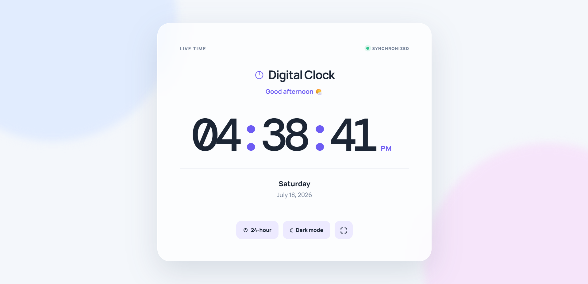

# ⏰ Digital Clock Web App

A modern and responsive **Digital Clock Web Application** built using HTML, CSS, and JavaScript.

This project displays the current time and updates automatically every second. I built this project as part of my JavaScript learning journey to practice working with the JavaScript Date object, DOM manipulation, and real-time updates.

## 📸 Preview

## ✨ Features

- ⏰ Displays current hours, minutes, and seconds
- 🔄 Updates automatically every second
- 🌅 Displays AM/PM
- 📅 Displays the current date
- 📆 Displays the current day
- 📱 Responsive design
- 🎨 Modern and clean user interface

## 🛠️ Technologies Used

- HTML5
- CSS3
- JavaScript

## 📂 Project Structure

digital-clock/
├── index.html
├── style.css
├── script.js
├── preview.png
└── README.md

## 🚀 Live Demo

Add your GitHub Pages live website link here.

## 💻 How to Run

1. Clone or download this repository.
2. Open the project folder.
3. Open `index.html` in your browser.
4. The digital clock will automatically display and update the current time.

## 🧠 What I Learned

While building this project, I practiced:

- JavaScript Date object
- `getHours()`
- `getMinutes()`
- `getSeconds()`
- `setInterval()`
- `padStart()`
- DOM manipulation
- Functions
- Template literals
- Real-time webpage updates

## 🔮 Future Improvements

In the future, I plan to add:

- 12-hour / 24-hour format toggle
- Dark and Light Mode
- Automatic greeting messages
- Fullscreen clock mode
- LocalStorage support
- Multiple clock themes
- World Clock functionality

## 👨‍💻 Author

**Mandeep Kumar Singh**

This project is part of my JavaScript learning journey.
